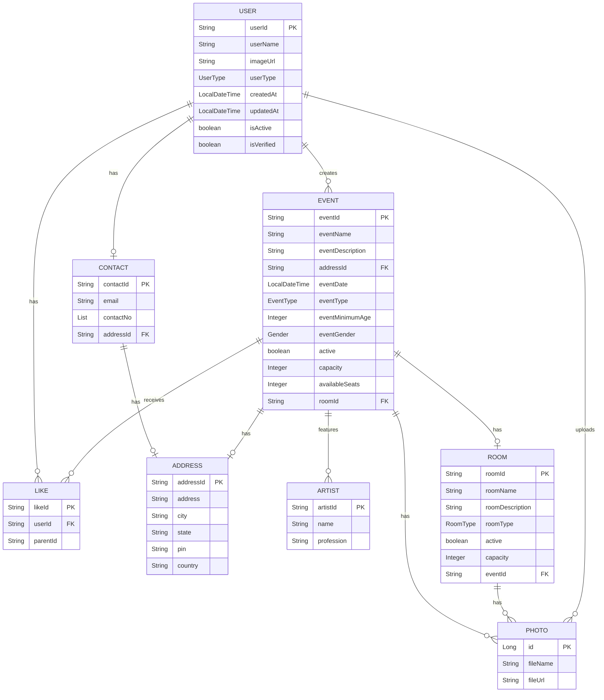

# Xplore - Entity Relationship Diagram

This document contains the Entity Relationship (ER) diagram for the Xplore project, showing the relationships between different entities in the system.

## Mermaid Diagram

## Key Relationships

1. **User Relationships**:
   - A User can have multiple Likes (One-to-Many)
   - A User has one Contact (One-to-One)
   - A User can create multiple Events (One-to-Many)
   - A User can upload multiple Photos (One-to-Many)

2. **Event Relationships**:
   - An Event has one Address (One-to-One)
   - An Event can have multiple Artists (One-to-Many)
   - An Event can have multiple Photos (One-to-Many)
   - An Event has one Room (One-to-One)
   - An Event can receive multiple Likes (One-to-Many)

3. **Room Relationships**:
   - A Room belongs to one Event (Many-to-One)
   - A Room can have multiple Photos (One-to-Many)

4. **Contact/Address**:
   - A Contact has one Address (One-to-One)

5. **Like**:
   - Likes are associated with a User and a parent entity (Event/Photo)

## Notes
- PK denotes Primary Key
- FK denotes Foreign Key
- The diagram shows the main entities and their relationships in the Xplore project
